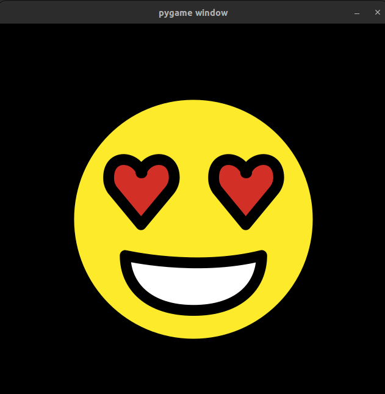

# Pygame Emojis

✨✨✨ Load emojis in pygame. ✨✨✨

[](https://github.com/ScienceGamez/pygame_emojis/actions/workflows/python-publish.yml)

This contain  **open source emojis**  from https://openmoji.org/




## Usage

It is very easy to include emojis in your game 😊

First install the  📦 package 📦
```
pip install pygame-emojis
```

Then import the package from 🐍 python 🐍

```python

from pygame_emojis import load_emoji

# Choose the size
size = (64, 64)

# Load the emoji as a pygame.Surface
surface = load_emoji('😍', size)

```

📥 The first time you use this package, it will automatically download  a svg database. ✌🏼

## Acknowledgements ❤️


Emojis come from https://openmoji.org/.

See also their repo https://github.com/hfg-gmuend/openmoji/.

Thanks a lot to the whole team: https://openmoji.org/about/#acknowledgement.

Thanks a lot to the developpers from pygame 🎮: https://www.pygame.org
